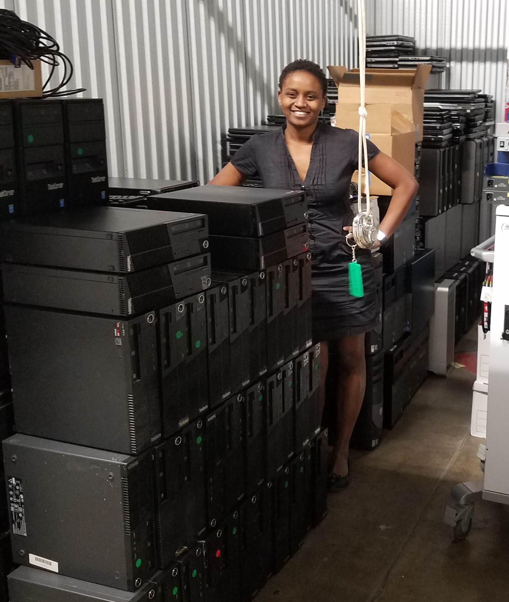

# About

My name is Nelly Cheboi. I am the founder of [TechLit Africa](https://techlitafrica.org/).

Digital technology has transformed how the world learns, communicates and does business. **But those who have the most to gain from modern technology are often left without them,** despite the vast surplus of devices and hardware that are thrown away every year.

Tyler Cinnamon and I are building an American nonprofit, [TechLit Africa](http://techlitafrica.org/), to level the playing field for africans. We believe people everywhere deserve access to the modern tools that can propel them to become the problem solvers of today and the leaders of tomorrow. **We repurpose surplus technology for communities to educate, do business and lead.**

**Last year, we built a computer lab in Mogotio, Kenya** \(a village without broadband internet\) that provides 200 rural Africans with digital skills and a WiFi “intranet.” We found a way to download the internet, providing villagers with terabytes of educational content that wouldn’t otherwise exist in their village. **This year, we will impact ten times as many lives** by building ten more computer labs, an African warehouse and a lessons platform to crowd-source career advice.

### The Problem

The economic condition of Africa is poor. These countries host some of the lowest GDP per capita and purchasing-power figures. Research shows that the adoption of technology in education, business and government can raise GDP, lower unemployment and improve the quality of life.

### **Our Approach**

We build computer labs in African schools, which often serve as gathering places for the whole community. Primary school students use the lab to learn from games that teach touch-typing, science and English. Older students can use our content to study, research and reinforce their learning on a wide range of topics. And adults have the breadth of Wikipedia, Stack Exchange and online forums at their disposal. Each lab is equipped with ten or more workstations and a local intranet serving content over WiFi.

Last year, we installed ten computers in Mogotio, Kenya that has no broadband internet. This first lab now provides access to our content for two hundred people. It is installed in a small schoolroom with a server and WiFi router. The lab is used during school hours to support education, and it is open to villagers after school hours, at no charge

### **The Founders**

Tyler and I met at our first engineering jobs. I first used a keyboard as I was applying to American schools from my home in Kenya, I worked hard to catch up to my American digital native peers. I now want everyone to be confident at the keyboard so they too can follow their dreams. Tyler, a self-taught programmer, can’t imagine a night without Google answering questions and opening a whole universe of information to him. Our unique background puts us in the perfect position to tackle the technology gap that exists in Africa today.

I grew up in abject poverty, in Mogotio, Kenya. Although I didn’t use a keyboard until I was eighteen, I now enjoy a successful career as a software engineer. In the beginning, typing in front of my team was so intimidating that I would tremble if required to type in that setting. I practiced for a year to gain the skill and confidence that my colleagues took for granted. I believe, through technology, my African community can find a sustainable solution to poverty.

Tyler is a self-taught programmer from Shabbona, Illinois. Though he didn’t pursue a software career early on, he was able to learn all the skills he now uses daily from freely available content online. Within a year, he was successful in a new field. Re-skilling is an essential tool for thriving in the digital revolution and Tyler is proof that a motivated person can gain skills if they have access to the right technology and content. Having seen rural education without modern resources like Google and Wikipedia, Tyler was determined to bring modern tools where they’re needed most.

### **Our 2019 Goals**

#### **Ten More Computer Labs**

Because of the success of our pilot lab in my hometown, we are expanding this project beyond our first lab. We have identified a handful of schools that are enthusiastic about this opportunity and have the volunteers and the space required to be a successful part of this project. With your support, we will be able to install ten new computer labs serving an estimated 2,000 rural, poor Kenyans this year, complete with ten or more workstations and updated content, all served over WiFi.

#### **A Self-sustaining Warehouse**

To ensure that each lab continually has ten or more functioning workstations, we will establish a central warehouse. The warehouse manager, along with volunteers, will be responsible for receiving shipments of equipment, refurbishing equipment, updating content and visiting the labs for maintenance.

#### **An Improved Platform**

We will build a platform that operates both with and without the internet, where experts can write lessons and serve the best content. This platform will be accessible at https://docs.techlitafrica.org for anyone to use. The source code will be published and connected so that experts can contribute and communities anywhere can benefit from our program.

\*\*\*\*



