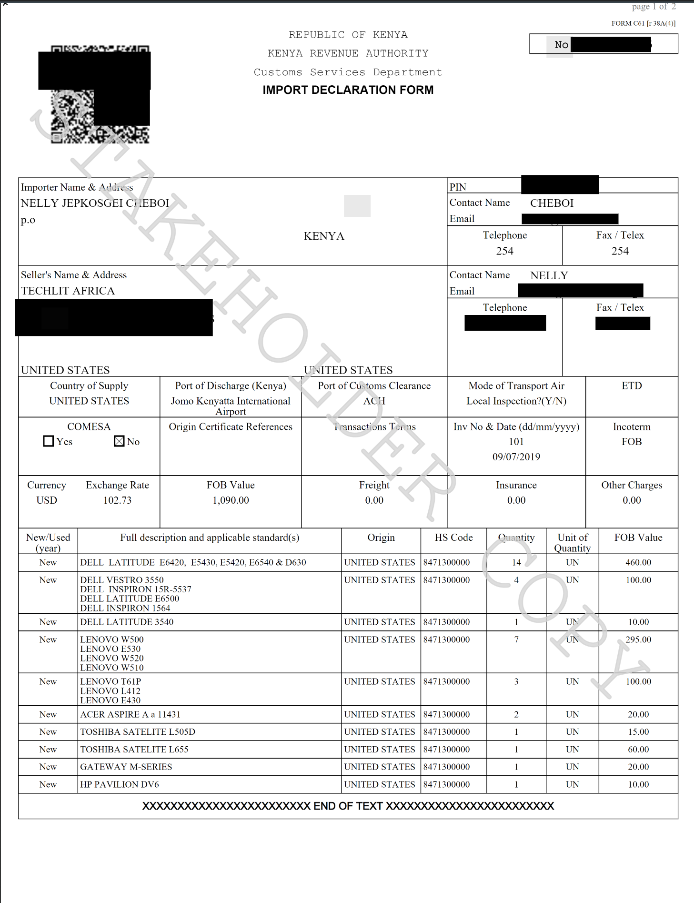

# Import Declaration Forms \(IDF\)

```csharp
// Overall cost at the end of this section
Running tab: $0
```

An IDF form is obtained from the Kenya Revenue Authority. To submit a request, the importer needs to prepare a proforma invoice. 

### Sample pro-forma invoice.



#### Approximating Value

> You should already know the manufacturer and model of your equipment at this point. Search for that model on eBay, Amazon and other websites. To lower the cost of your equipment, consider a few things: Is the equipment damaged at all \(scratched, dented or missing parts\)? Does the machine ship with the final operating system? Will modern software run significantly slower? All of these questions should lower the final value of the equipment. A modern OS would add $30 - $40 to the price you find on any marketplace, for instance.

### Requesting for the form

If you have a certified clearing agent on the ground. They can submit the IDF form request. The request takes ~2 business days to be processed.  

> I am yet to find out if you can submit the request yourself online or the clearing agents have a special login.

### The Key Components on the  IDF form

**Value of the cargo for tax calculation.** 

> Note that values may be disputed by customs and cargo verified to solve any disputes over the same. It is strongly advised to use correct values.

**Quantity.** 

> Should be as detailed and correct as possible. Every slightly different type of goods should have their own specified quantity rather than grouping similar items.

**Quality.** 

> This should also be backed up by the inspection. Other control bodies such the Kenya Bureau of Standards, Public Health Department, Department of Agriculture \(Kephis\) etc. may be asked to determine if the expected standards have been met. Incase of suspicion, Tests may be carried out and Certificates/Permits issued. Under this criteria, test Certificates from accredited bodies may be required.

**Classification \(HS Code\):** 

> Just like the other items these might be queried so it is best to ask beforehand if not sure especially if different HS codes attract different taxation.

## Sample IDF Form



> Once the IDF is approved, you might proceed to arrange inspection of the cargo \(see 1.2\) and once completed \(or not required\) ship the cargo.

