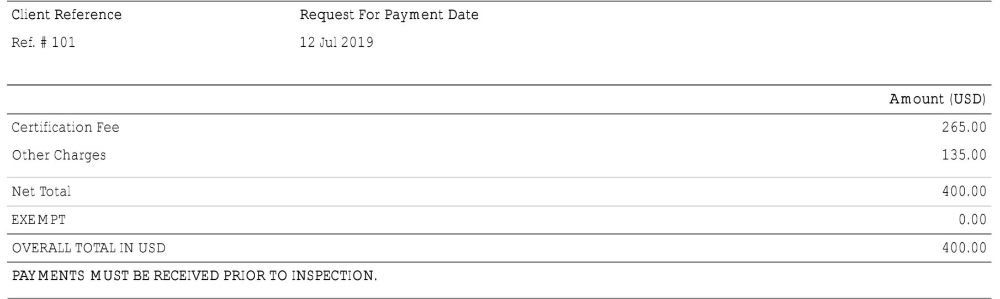

# Certificate of Conformity\(COC\) from PVoC agent

```csharp
// Overall cost at the end of this section
Inspection Cost: $400
Running tab: $400
```

The Kenya Bureau of Standards has appointed certain agents  for the conformity inspection of the commodities that require inspection.

The following agents have been contracted by Kenya Bureau of Standards for the conformity inspection of the commodities that require inspection. 

> Used computers requires inspection

1. Intertek:
   *  [http://www.intertek.com/government/product-conformity/exports/kenya/](http://www.intertek.com/government/product-conformity/exports/kenya/)
2. SGS
   * [https://www.sgs.com/](https://www.sgs.com/)
3. Bureau Veritas
   * [https://www.sgs.com/](http://www.us.bureauveritas.com/)

## Intertek

> I have only had experience with Intertek.

### Documents to get started

1. [Pro-forma invoice](import-declaration-forms-idf.md#sample-pro-forma-invoice)
2. [Import Declaration Forms \(IDF\)](import-declaration-forms-idf.md#sample-idf-form)

### Submitting a Request for Inspection

> You can submit a request from their website.



> When the CS Rep reaches out to you. The will send you the most recent version of inspection request form.

**Submit the form back along with the IDF form and the Pro-forma invoice.**

### Inspection invoice

> It was my very first time requesting for inspection. I am not sure if this is the standard price.



### Inspection Scheduled

> Once the payment is processed and inspector is assigned to you. It could take upto three business days . The inspectors come to you.

